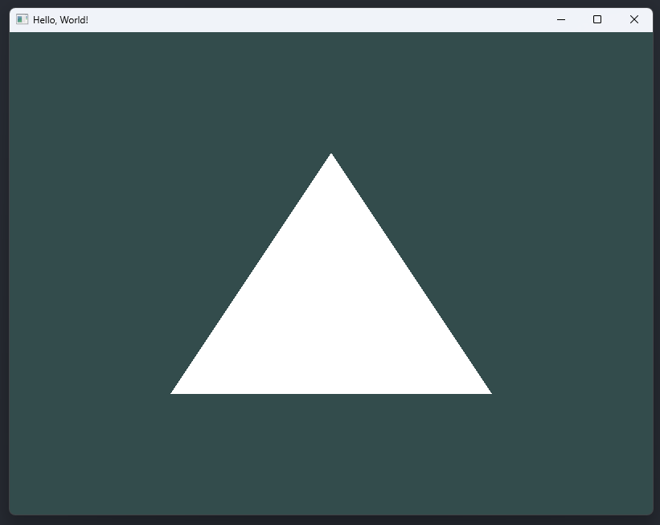
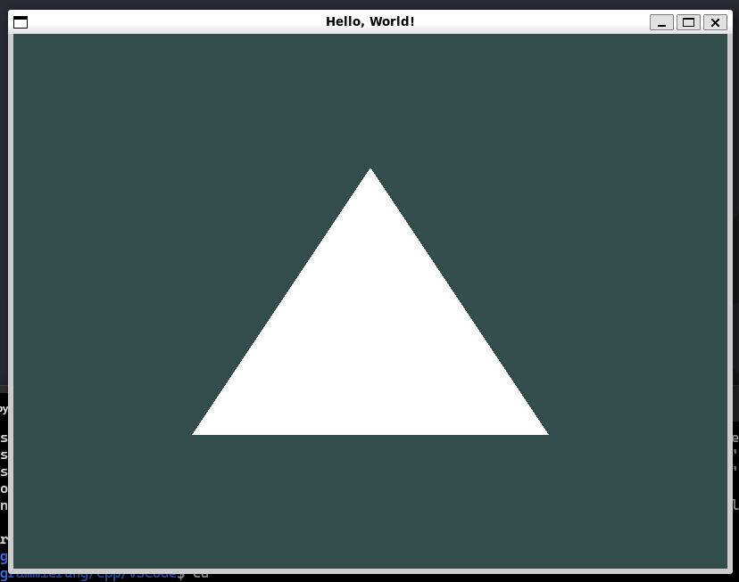

# OpenGL Template

Dieses Projekt ist ein Template für OpenGL-Projekte, das mit GLFW erstellt wurde.

## Build

### Windows

```bash
~$ make windows
```

### Linux
```bash
// Linux
~$ make linux
```

## Ausführbarkeit
| Betriebssystem | Ausführbarkeit |                        Bild                         |
| :------------: | :------------: | :-------------------------------------------------: |
|    Windows     |       Ja       |  |
|     Linux      |       Ja       |    |